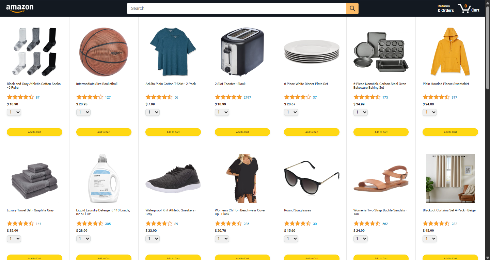
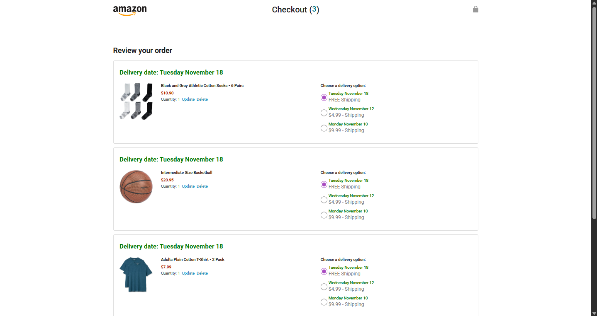
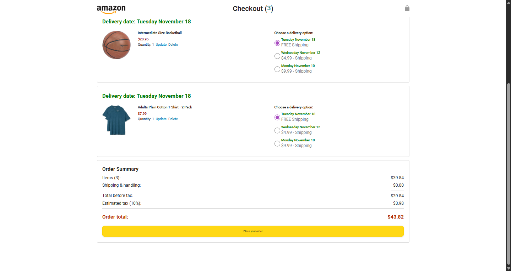
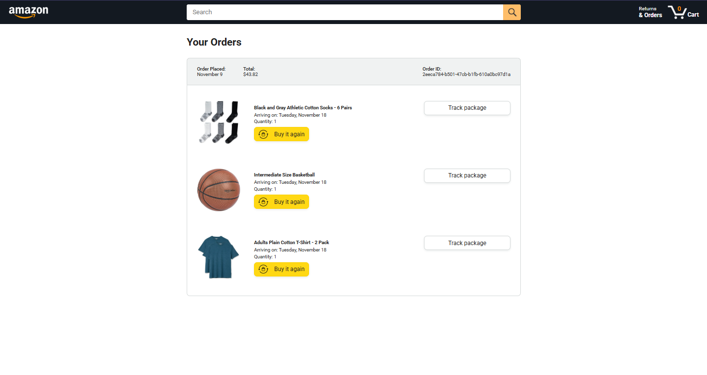
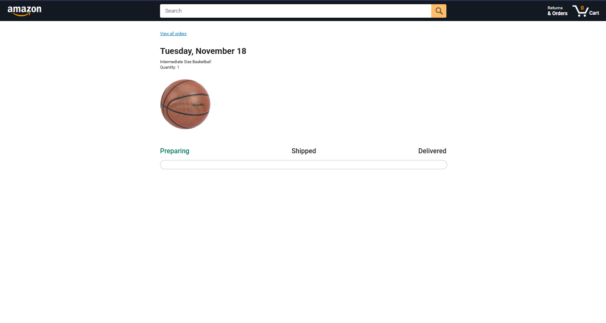

# 🛒 Amazon Clone Project - Checkout & Tracking System

This project is a simulation of the core functionality within the purchasing and order management flow of an e-commerce platform. It focuses on modular JavaScript architecture, data persistence handling (localStorage), and the rigorous implementation of tests.

## Thanks to SuperSimpleDev

This project is the result of the JavaScript course of **SuperSimpleDev**.

* **Course (Youtube):** [https://www.youtube.com/watch?v=EerdGm-ehJQ&t](https://www.youtube.com/watch?v=EerdGm-ehJQ&t)
* **Reference files (GitHub):** [https://github.com/SuperSimpleDev/javascript-course](https://github.com/SuperSimpleDev/javascript-course)

## Screenshots







## Key Features

This project implements three main modules with specific business logic:

* Cart Module (cart): Manages adding, deleting, quantity updates, and data persistence using localStorage.

* Orders Module (orders): Handles the checkout process, new order generation, shipping date calculations (excluding weekends), and order persistence.

* Tracking Module: Simulates shipping progress, implements conditional deletion logic for delivered products, and handles page redirection (simulating basic logistics integration).

## Architecture and Technology

The project follows a modular approach, separating business logic from DOM manipulation (Separation of Concerns).

### Classes and Data Structure:

* Order Class: Object-Oriented Programming (OOP) is implemented with private properties (#) to ensure data encapsulation within the order objects.

* Persistence: All data (Cart and Orders) is saved to and reconstructed from localStorage.

* Dates: The Day.js library is used for advanced time handling, which is crucial for calculating delivery dates while avoiding weekends.

### Design Patterns:

Dependency Injection (DI): Implemented in pure logic functions like calculateDeliveryProgress to isolate the dependency on the current time (dayjs()) and make the functions easily testable and predictable.

## Testing and Code Quality

The project was developed using a Test-Driven Development (TDD) approach to ensure the robustness of the business logic.

### Frameworks:

Jasmine: Used as the primary framework for unit testing.

### Test Coverage

Over 80 tests have been implemented, covering the business logic and edge cases of the following core functionalities:

* Cart Module: Addition, deletion, quantity updates, and persistence.

* Orders Module: New order creation and the delivery date calculation logic (jumping over Saturdays and Sundays).

* Tracking Module:

* Time Logic: Tests for 0%, 50%, and 100% progress using time mocks (DI).

* Refined Deletion Logic: Tests for the removeProductFromOrder function, ensuring the order is only deleted if no pending products remain.

* UI Logic: Verification of correct CSS class application for progress statuses (Preparing, Shipped, Delivered) based on thresholds (33% and 66%).

## Installation and Execution

To run the project locally, follow these steps:

* Clone the repository:

```
git clone https://github.com/JesusHM0406/amazon-project
cd [amazon-project]
```

* Open with a Local Server: Since the project uses ES Modules (import ... from "...") and accesses localStorage, it will not run correctly by opening files directly (file://).

* Use a VS Code extension like Live Server or a simple Node.js server.

* Open the main file (amazon.html or index.html) via your local server's URL (e.g., http://127.0.0.1:5500/amazon.html).

### Run Tests:

Navigate to the tests file (e.g., test/jasmine.html) on your local server.

## This project is under MIT LICENSE

Look the [LICENSE](LICENSE) file for more detail.